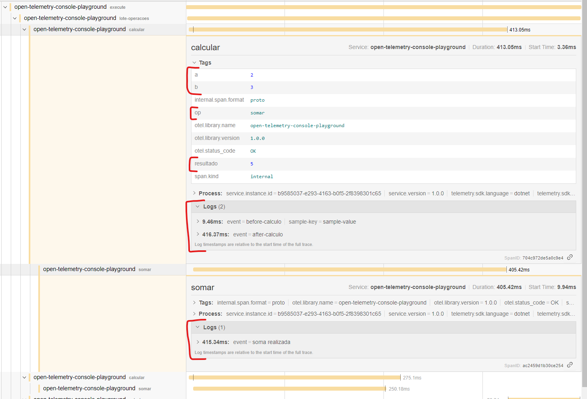
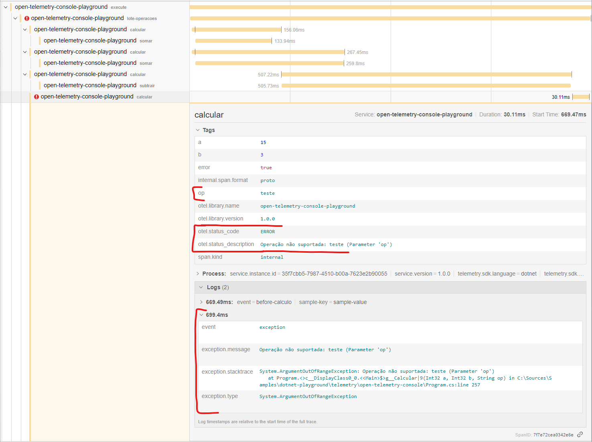
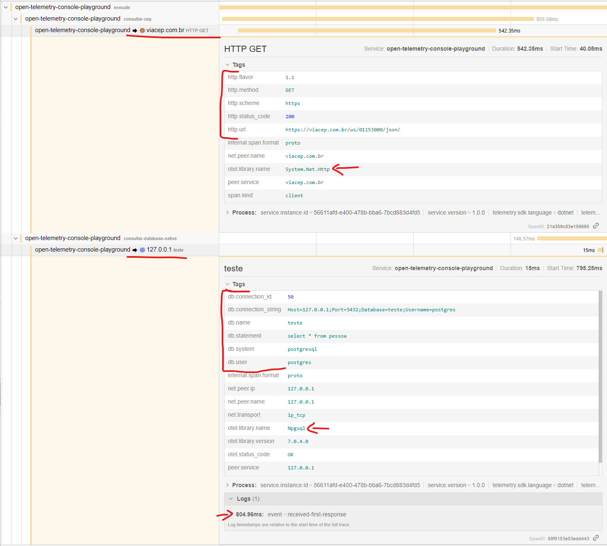

# Telemetria

- [OpenTelemetry](https://github.com/open-telemetry/opentelemetry-specification) é o sucessor do [Open Tracing](https://github.com/opentracing/specification/blob/master/specification.md).
- Padrão OTLP (OpenTelemetry Protocol) é suportado por outras ferramentas além do Jaeger, bastando apenas alterar o endpoint para sincronização dos dados.
- [Padrão W3C para tracing distribuido: **traceparent** header](https://www.w3.org/TR/trace-context/#design-overview).
- **Sampler**: Politica de coleta de dados (100% ou uma amostra);

## Ferramentas

- [Jaeger](https://www.jaegertracing.io/): Jaeger: open source, end-to-end distributed tracing ([JAEGER.md](JAEGER.md)).
- [SigNoz](https://signoz.io): Open Source Observability with Traces, Logs and Metrics in a single pane ([SIGNOZ.md](SIGNOZ.md)). 

### Terminologia

- Span: Unidade de trabalho. Possui nome da operação, hora de início e duração. Podem estar aninhados e ordenados para modelar relacionamentos.
- Trace: Representa os dados ou o fluxo de execução pelo sistema. É composto de um ou vários spans.
- [Baggage](https://opentelemetry.io/docs/specs/status/#baggage): Metadados adicionais anexados ao span e propagados pelo SDK de tracing ([W3C Baggage]([https://www.w3.org/TR/baggage)).  
  Não é um dado armazenado pelo coletor e não é exibido na interface de exploração do tracing.
- Status: Ok, Unset ou Error. Permite anexar descrição adicional.

## dotnet OpenTelemetry SDK

:warning: Library [jaeger-client-cshap](https://github.com/jaegertracing/jaeger-client-csharp)(Jaeger + Jaeger.Core) foi descontinuada e a instrução é utilizar [opentracing-csharp](https://github.com/opentracing/opentracing-csharp) (OpenTracing).

- [Getting Started OpenTracing](https://opentelemetry.io/docs/instrumentation/net/getting-started/)
- [Cart sample](https://opentelemetry.io/docs/demo/services/cart/)
- `OpenTelemetry.Trace.SemanticConventions`: Classe com convensões padrões
- Padrões para ingestão dos headers no tracing distribuido (RabbitMQ, Kafka e atividade em geral que não possui instrumentações nativas)
	- [Projeto .net](https://github.com/open-telemetry/opentelemetry-dotnet/tree/main/examples/MicroserviceExample)
	- [Convenções de headers](https://github.com/open-telemetry/opentelemetry-specification/blob/main/specification/trace/semantic_conventions/messaging.md#span-name)

## Exemplos de processo com telemetria

### Visão geral do processo de cálculo

Dentro de `lote-operacoes` foram feitos três calculos, sendo duas somas em paralelo e uma subtração.


### Recurso de tags e logs

Utilizado **tags** para armazenar os valores do processo e **logs** para os eventos `before-calculo` e `after-calculo`.

O tempo apresentado no log é automaticamente calculado pelo OpenTracing e é representado em relação ao root span (início do processo). Indica o momento que o código fonte gerou o evento.



### Erros

- Para indicar erro no processo, deve-se utilizar o método `span.SetStatus(ActivityStatusCode.Error, ex.Message);` para definir os valores de tags.
	- `otel.status_code`: Primeiro argumento. Isso que informa ao tracing para criar o simbolo de erro em vermelho.
	- `otel.status_description`: Segundo argumento. Descrição opcional para erros.
- Para registrar os detalhes da exception (opcional), existe o facilitador `span.RecordException(ex)` para geração do evento.
	- Por convenção os pacotes que adicionam instrumentações automatica, entregam o facilitador para realizar isso automaticmante. Exemplo: `.AddHttpClientInstrumentation(opts => opts.RecordException = true)`



### Http Request e Database Query

Outros exemplos de instrumentações realizadas automaticamente por libraries já prontas.

Neste exemplo é realizado duas operações:

- Http Request (saída da aplicação): Consultado um CEP em `https://viacep.com.br/ws/{cep}/json/`.
- Database Query: Consultado a tabela `pessoa` no banco de dados `teste` do tipo PostgreSQL.

Os dados coletados são automáticos de acordo com a instrumentação do projeto:

```csharp
using var tracerProvider = Sdk.CreateTracerProviderBuilder()
    .AddSource(ServiceName)
    .SetResourceBuilder(ResourceBuilder.CreateDefault()
        .AddService(serviceName: ServiceName, serviceVersion: ServiceVersion))
    .AddHttpClientInstrumentation(opts => opts.RecordException = true)	// Telemetria de saída HTTP com registro de detalhes de exceptions
    .AddNpgsql()														// Telemtria de PostgreSQL
....
```


